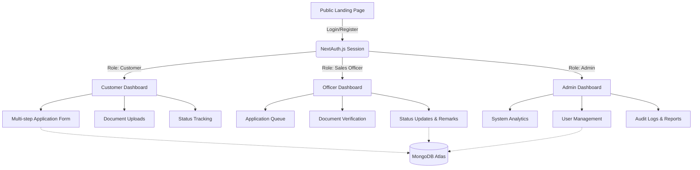

# EasyOil: System Architecture & Operations Guide

Welcome to the **EasyOil B2B Customer Onboarding Portal**. This document serves as a comprehensive guide for new developers, administrators, sales officers, and customers to understand the system's architecture, functionality, and daily operations.

---

## 1. System Architecture & Visual Flow

EasyOil is built on a modern, robust web stack designed for production readiness, type safety, and scalability.

### Technical Stack
*   **Frontend**: Next.js 15 (App Router), React 19, Tailwind CSS (IndianOil corporate theme: Blue `#0054A6` & Orange `#FF6600`), Shadcn UI, Recharts.
*   **Backend**: Next.js API Routes (Serverless), Node.js.
*   **Database**: MongoDB (via Mongoose).
*   **Authentication**: NextAuth.js (v5) with custom Role-Based Access Control (RBAC).

### Visual Architecture & Data Flow
The application follows a strict Role-Based Routing architecture:



---

## 2. Developer Guide: How to Operate

### Prerequisites
*   Node.js (v18+)
*   MongoDB Instance (Local or Atlas)

### Setup & Running Locally
1.  **Environment Variables**: Copy `.env.example` to `.env.local` and fill in the credentials.
    ```env
    MONGODB_URI=mongodb+srv://<user>:<password>@<cluster>.mongodb.net/<db>
    NEXTAUTH_SECRET=<your-secret>
    NEXTAUTH_URL=http://localhost:3000
    ```
2.  **Install Dependencies**: Run `npm install`.
3.  **Run Development Server**: Run `npm run dev`. The app will be available at `http://localhost:3000`.
4.  **Database Seeding** *(Development Only)*: Navigate to `/api/db/seed` in your browser while in development mode to populate the database with mock admins, officers, customers, and test applications.

### Production Build
*   The system is configured with strict TypeScript checking and linting.
*   Run `npm run build` to create an optimized production build.
*   Run `npm start` to serve the production build.
*   *Security Note*: Debug endpoints (like `/api/db/seed`) are automatically disabled in production mode.

---

## 3. User Guide (Customer)

The Customer portal is designed to be a frictionless onboarding experience.

### Functionality Walkthrough
1.  **Registration**: New users register with their Name, Email, Mobile, and Password.
2.  **Dashboard**: Upon login, the customer sees their application status.
3.  **Application Form**: A multi-step wizard guides the customer through:
    *   **Step 1**: Business Details (GST, PAN, Address).
    *   **Step 2**: Logistics & Requirements (Product Type, Quantity, Storage).
    *   **Step 3**: Document Uploads (PDF/Image support, Max 5MB).
    *   **Step 4**: Review & Submit.
4.  **Status Tracking**: Customers can log in anytime to see if their application is `Submitted`, `Under Review`, `Correction Required`, or `Approved`. If corrections are needed, they can re-upload specific documents.

---

## 4. Sales Officer Guide

Sales Officers are the operational backbone, responsible for vetting applications.

### Functionality Walkthrough
1.  **Application Queue**: The officer dashboard displays a data table (TanStack Table) of all applications assigned to them or pending review.
2.  **Document Verification**: Officers can click into an application to view uploaded compliance documents. They can mark individual documents as `Verified` or `Rejected`.
3.  **Workflow Management**: 
    *   If documents are missing or invalid, the officer sets the status to `Correction Required` and adds remarks.
    *   If everything is in order, the officer updates the status to `Approved`.
4.  **Audit Trail**: Every action (approvals, rejections, remarks) is logged and timestamped for accountability.

---

## 5. Admin Guide

Administrators have a bird's-eye view of the entire system and manage personnel.

### Functionality Walkthrough
1.  **Analytics & Charts**: The admin dashboard features Recharts visualizations showing application volumes, status breakdowns, and processing times.
2.  **User Management**: Admins can view all registered users and assign specific applications to Sales Officers.
3.  **Reports & Export**: Admins can generate and download system reports in Excel or PDF formats for offline review.
4.  **Audit Logs**: Access to system-wide activity logs to monitor who did what and when, ensuring compliance and security.

---

## Security & Production Hardening Details

*   **API Security**: All API routes validate the NextAuth session. Role-based guards prevent users from accessing endpoints meant for other roles.
*   **File Uploads**: Files are strictly validated by size and extension type before being processed.
*   **Error Handling**: Production error responses are sanitized to prevent leaking stack traces or internal database structures to the client.
*   **Headers**: Standard security headers (X-Content-Type-Options, X-Frame-Options) are enforced via Next.js Middleware.
